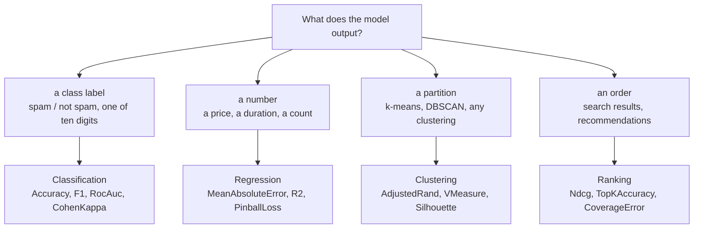

# Which metric? — evaluating a model with `Lodestar.Metrics`

`Lodestar.Metrics` reproduces `sklearn.metrics`: 44 types and 58 documented members
across four families, at parity with scikit-learn 1.9.1 and with no Python at runtime.

The [reference pages](../reference/metrics/classification.md) answer *what does this function do* — one
page per member, checked against the assembly. They cannot answer **which one to
reach for**, because that question spans types. This guide is that question.

```bash
dotnet add package Lodestar.Metrics
```

## Start here — what does your model predict?



Each family's index page carries the decision *within* it — including a flowchart
of its own for classification and regression:

| The model predicts | The family | Start at |
| --- | --- | --- |
| a class, or a score you will threshold | classification | [`classification.md`](../reference/metrics/classification.md) |
| a continuous number | regression | [`regression.md`](../reference/metrics/regression.md) |
| a grouping, with or without a reference | clustering | [`clustering.md`](../reference/metrics/clustering.md) |
| an ordering, or a set of labels with scores | ranking | [`ranking.md`](../reference/metrics/ranking.md) |

## The four questions, in one line each

**Classification — the averaging mode changes the answer more than the metric does.**
On imbalanced classes `Averaging.Micro` reports how the model does on the common
class and `Averaging.Macro` how it does on the rare one; picking `F1` over
`Precision` moves the number far less than picking between those two.

**Regression — an error lives in the target's units and a score does not.**
`MeanAbsoluteError` is in euros, seconds or items and cannot be compared across two
different targets; `R2` and `ExplainedVariance` are unitless and can. How one very
bad prediction should count is the other axis: squared errors let it dominate,
`MedianAbsoluteError` is unmoved by outliers up to half the sample.

**Clustering — "corrected for chance" is the question, not a detail.** Put every
sample in a cluster of its own and `Homogeneity` scores a perfect `1`, because each
cluster does hold a single class; `AdjustedRand` scores `0` on the same input,
because that is what random labelling achieves. When a clustering looks suspiciously
good, read those two together. `Silhouette` is the one that needs no reference
partition at all.

**Ranking — position matters, and ties are where implementations diverge.** The same
documents score differently depending on where the good ones landed. Equal scores
have their discounted gain averaged over the permutations of the tie, which is a
different number from ranking them arbitrarily — `0.807` against `0.614` on a row
whose four scores are equal.

## One shape, whatever the family

Every member takes its 2-D input **row-major with a count**, because a
`ReadOnlySpan<T>` cannot carry a second dimension:

```csharp
using Lodestar.Metrics;

// Two queries over four documents each: eight values and a labelCount of 4.
double[] relevance = [3, 2, 1, 0, 3, 2, 1, 0];
double[] scores = [0.9, 0.5, 0.4, 0.1, 0.1, 0.4, 0.5, 0.9];

double ndcg = Ndcg.Score(relevance, scores, labelCount: 4);
```

That call is [`Ndcg.Score`](../reference/metrics/ranking/ndcg-score.md); every 2-D
member takes its input the same way, and there is no overload that takes a `[,]`.

Most members take an optional `sampleWeight`, one weight per sample, and it is a
**weighted mean** rather than a repetition count. A vector summing to zero raises in
`numpy.average`'s own sentence — except in
[`LabelRankingAveragePrecision.Score`](../reference/metrics/ranking/labelrankingaverageprecision-score.md),
which divides directly and returns `NaN`, and in
[`TopKAccuracy.Score`](../reference/metrics/ranking/topkaccuracy-score.md) with
`normalize: false`, which never divides at all. A negative weight is accepted
everywhere and can take the result outside the range its page promises. All three are
the reference's behaviour, reproduced rather than smoothed.

An undefined metric — precision for a class nothing was predicted into — is settled
by a `ZeroDivision` argument rather than a warning: return `0`, return `1`, return
`NaN` — which is what [`R2.Score`](../reference/metrics/regression/r2-score.md)
defaults to — or throw `UndefinedMetricException`. scikit-learn warns and continues;
this package makes you choose, which is
the projection rule.

## A worked example in each family

```csharp
using Lodestar.Metrics;

// Classification — look at the matrix before reporting a single number.
int[] truth = [0, 1, 2, 2, 1, 0, 1, 2, 2, 2];
int[] predicted = [0, 2, 2, 1, 1, 0, 1, 1, 2, 2];

ConfusionMatrix cm = ConfusionMatrix.Compute(truth, predicted);
double accuracy = Accuracy.Score(cm);
double balanced = BalancedAccuracy.Score(cm);
double macroF1 = F1.Score(cm, Averaging.Macro);

// The per-class table, which is what a report actually shows.
ClassificationReport report = ClassificationReport.Compute(cm);
```

[`ConfusionMatrix.Compute`](../reference/metrics/classification/confusionmatrix-compute.md)
is what the rest read: [`Accuracy.Score`](../reference/metrics/classification/accuracy-score.md),
[`BalancedAccuracy.Score`](../reference/metrics/classification/balancedaccuracy-score.md),
[`F1.Score`](../reference/metrics/classification/f1-score.md) with an
[`Averaging`](../reference/metrics/classification/averaging.md) mode, and
[`ClassificationReport.Compute`](../reference/metrics/classification/classificationreport-compute.md)
for the per-class table.

```csharp
using Lodestar.Metrics;

// Regression — an error and a score, side by side.
double[] observed = [3.0, -0.5, 2.0, 7.0];
double[] estimated = [2.5, 0.0, 2.0, 8.0];

double mae = MeanAbsoluteError.Score(observed, estimated);
double rmse = RootMeanSquaredError.Score(observed, estimated);
double r2 = R2.Score(observed, estimated);
```

[`MeanAbsoluteError.Score`](../reference/metrics/regression/meanabsoluteerror-score.md)
and [`RootMeanSquaredError.Score`](../reference/metrics/regression/rootmeansquarederror-score.md)
are in the target's units; [`R2.Score`](../reference/metrics/regression/r2-score.md) is not,
which is what makes it comparable across two different targets.

```csharp
using Lodestar.Metrics;

// Clustering — the pair that disagrees is the pair worth reading.
int[] reference = [0, 0, 0, 1, 1, 1];
int[] everySampleAlone = [0, 1, 2, 3, 4, 5];

double homogeneity = Homogeneity.Score(reference, everySampleAlone);
double adjustedRand = AdjustedRand.Score(reference, everySampleAlone);
```

[`Homogeneity.Score`](../reference/metrics/clustering/homogeneity-score.md) answers `1`
here and [`AdjustedRand.Score`](../reference/metrics/clustering/adjustedrand-score.md)
answers `0`, on the same input. That gap is the correction for chance, and it is the
whole reason to read the two together.

```csharp
using Lodestar.Metrics;

// Ranking — a label matrix, one boolean per label per sample.
bool[] relevantLabels = [true, false, false, false, false, true];
double[] labelScores = [0.75, 0.5, 1.0, 1.0, 0.2, 0.1];

double coverage = CoverageError.Score(relevantLabels, labelScores, labelCount: 3);
double lrap = LabelRankingAveragePrecision.Score(relevantLabels, labelScores, labelCount: 3);
```

[`CoverageError.Score`](../reference/metrics/ranking/coverageerror-score.md) reads down
to the worst-ranked relevant label, and
[`LabelRankingAveragePrecision.Score`](../reference/metrics/ranking/labelrankingaverageprecision-score.md)
asks how much of the lead above each relevant label is itself relevant.

## Where the numbers are not what you expect

Three answers look like bugs and are the reference's, reproduced deliberately. Each
is stated on the page of the member it affects, and each has cost a reader time:

- A clustering metric scores `1` on an **empty input**, and on a single sample.
  Agreeing about nothing is agreeing.
- `CoverageError` gives a sample with no relevant label `0` rather than the label
  count, so its mean can sit **below `1`** — `0.5` on two samples one of which is
  empty.
- `LabelRankingAveragePrecision` accepts a single label column and returns `1`,
  where `CoverageError` and `LabelRankingLoss` refuse it. That is scikit-learn
  disagreeing with itself, and making the three agree would invent a divergence
  rather than copy one.

[`docs/equivalence.md`](../equivalence.md) maps every Python call to its C#
counterpart and lists each divergence, and [`docs/decisions/`](../decisions/README.md) has the
reasoning where behaviour departs from the reference on purpose.

## Where to go next

- [Reference — classification](../reference/metrics/classification.md), the largest
  family, with `ConfusionMatrix` underneath all of it.
- [Reference — regression](../reference/metrics/regression.md), including how the
  multi-output parameters fit together.
- [Reference — clustering](../reference/metrics/clustering.md).
- [Reference — ranking](../reference/metrics/ranking.md), whose two halves take
  different input: one ordered list, and a label matrix.
- [`docs/equivalence.md`](../equivalence.md) if you are porting from scikit-learn.
