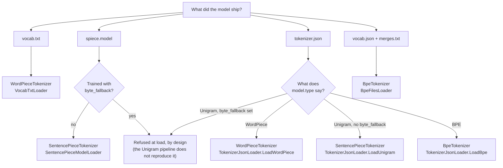

# Tokenization — `Lodestar.Embeddings.Tokenization`

A transformer does not read text; it reads token ids. This namespace turns one into the other,
for the three sub-word algorithms the models in use are built on, and it reproduces HuggingFace
`tokenizers` and `sentencepiece` closely enough that the ids match theirs.

Getting them to match matters more than it sounds: a model fed ids from the wrong tokenizer
returns vectors that are confidently wrong rather than an error.

## Which tokenizer?

The answer is **whichever the model was trained with** — this is not a choice you get to make. The
model's own files say which, and which loader reads them:

**A `tokenizer.json` does not say which loader to call — its `model.type` does.** The three
`Load…` methods each assert it and refuse a file declaring another, so reaching for the wrong one
fails with a message naming the mismatch rather than producing ids that look plausible.

**`byte_fallback` means something different on each path it can appear on.** Python resolves an
uncovered character into `<0x..>` byte pieces where these tokenizers would otherwise emit the
unknown piece — silently ignoring the flag would return confidently wrong vectors, so the
Unigram lineage (`spiece.model`, or a `tokenizer.json` declaring `model.type: "Unigram"`) refuses
a checkpoint that declares it, unconditionally: that pipeline does not reproduce it. The BPE
lineage does: [`TokenizerJsonLoader.LoadBpe`](persistence/tokenizerjsonloader-loadbpe.md) resolves
an uncovered symbol into the `<0xXX>` byte pieces the flag promises, which is what lets Llama-2 and
Mistral v0.1 — the SentencePiece-BPE lineage tracked at
[#175](https://github.com/CyrilB1531/lodestar/issues/175) and scoped by
[decision 0005 §3](../../decisions/0005-the-proof-standard-and-the-oracle-each-family-is-frozen-from.md) — load at all, and refuses only a
vocabulary that declares the flag without carrying all 256 pieces ([decision 0007](../../decisions/0007-the-deliberate-divergences.md)).

The same routing, as a table:

| The model ships | Use | Loaded from |
| --- | --- | --- |
| `vocab.txt` | [`WordPieceTokenizer`](tokenization/wordpiecetokenizer.md) | BERT and its descendants |
| `spiece.model` | [`SentencePieceTokenizer`](tokenization/sentencepiecetokenizer.md) | T5, ALBERT, XLM-R, camemBERT |
| `merges.txt` or a `tokenizer.json` with merges | [`BpeTokenizer`](tokenization/bpetokenizer.md) | GPT-2, Llama-3, Qwen2 |

All three implement [`ISubwordTokenizer`](tokenization/isubwordtokenizer.md), so code that only
encodes can be written once against that.

## The three families, and what actually differs

**WordPiece** splits a word into the longest pieces its vocabulary holds, marking every piece
after the first with a continuation prefix — `##ize` is "ize, continuing a word". A word it cannot
cover at all becomes a single unknown token, not a sequence of partial ones.

**SentencePiece** treats the text as a stream and encodes the space itself, as `▁`. That is why
its tokens carry a leading `▁` and why it needs no pre-tokenizer: word boundaries are inside the
vocabulary rather than assumed by a regex.

**BPE** starts from characters and applies a ranked list of merges in order. Byte-level BPE — what
GPT-2 and Llama-3 use — maps bytes to printable characters first, which is what lets it round-trip
**any** input exactly, emoji and broken UTF-8 included.

## From text to a model's input

Encoding one string gives a [`TokenizationResult`](tokenization/tokenizationresult.md). Feeding a
model wants more than that: a rectangular batch, padded, with an attention mask and the model's
own special tokens. [`BatchEncoder`](tokenization/batchencoder.md) does that, driven by
[`EncodingOptions`](tokenization/encodingoptions.md) and a
[`SpecialTokenTemplate`](tokenization/specialtokentemplate.md), and hands back an
[`EncodedBatch`](tokenization/encodedbatch.md).

The template has to match the model **and** the vocabulary: asking for
`SpecialTokenTemplate.Bert` against a vocabulary with no `[CLS]` is refused at construction rather
than encoded into something the model will misread.

## Types

| Type | What it is |
| --- | --- |
| [`AddedToken`](tokenization/addedtoken.md) | A token matched literally, before the model sees the text. |
| [`BatchEncoder`](tokenization/batchencoder.md) | Strings in, a padded batch with an attention mask out. |
| [`BpePatterns`](tokenization/bpepatterns.md) | The four pre-tokenizer regexes real BPE models use. |
| [`BpeSplitStep`](tokenization/bpesplitstep.md) | A Split step ahead of ByteLevel, as Llama-3 declares one. |
| [`BpeTokenizer`](tokenization/bpetokenizer.md) | Byte-level and classic BPE, encoding and decoding. |
| [`BpeVocabulary`](tokenization/bpevocabulary.md) | A BPE model: the vocabulary, the merges, and the flags. |
| [`EncodedBatch`](tokenization/encodedbatch.md) | The rectangular result: ids, mask, and true lengths. |
| [`EncodingOptions`](tokenization/encodingoptions.md) | Length, truncation, template, and batching. |
| [`ISubwordTokenizer`](tokenization/isubwordtokenizer.md) | What the three tokenizers have in common. |
| [`MergePair`](tokenization/mergepair.md) | One BPE merge rule, left and right. |
| [`PrecompiledNormalizer`](tokenization/precompilednormalizer.md) | SentencePiece's charsmap normalization. |
| [`SentencePiece`](tokenization/sentencepiece.md) | One piece: its text, its score, its id. |
| [`SentencePieceTokenizer`](tokenization/sentencepiecetokenizer.md) | Unigram encoding over a SentencePiece vocabulary. |
| [`SentencePieceType`](tokenization/sentencepiecetype.md) | What a piece is for — normal, control, unused. |
| [`SentencePieceVocabulary`](tokenization/sentencepiecevocabulary.md) | The pieces, their types, and the four special ids. |
| [`SpecialTokenTemplate`](tokenization/specialtokentemplate.md) | Which tokens wrap a sequence, per model family. |
| [`SplitBehavior`](tokenization/splitbehavior.md) | What a Split step does with the text it matched. |
| [`TokenizationResult`](tokenization/tokenizationresult.md) | Tokens and ids, from encoding one string. |
| [`TruncationStrategy`](tokenization/truncationstrategy.md) | Which end is cut when a sequence is too long. |
| [`WordPieceTokenizer`](tokenization/wordpiecetokenizer.md) | Longest-match sub-word encoding with a continuation prefix. |
| [`WordPieceVocabulary`](tokenization/wordpiecevocabulary.md) | The vocabulary and the settings that read it. |

## See also

- [Semantic search with embeddings](../../guides/embeddings.md) — the guide, end to end.
- [ONNX inference](../onnx/inference.md) — `Lodestar.Onnx`, what consumes the ids this namespace produces.
- [Python → C# equivalence](../../equivalence.md) — every `tokenizers` call and its counterpart.
