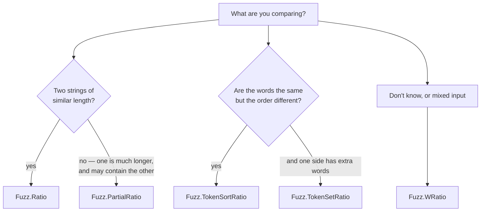

# Fuzzy matching — `Lodestar.Fuzzy`

Two strings that are nearly the same, and the question of how nearly.
`Lodestar.Fuzzy` reproduces `rapidfuzz`: `fuzz.*` scorers in `[0, 100]`, `process.extract` over a
list of candidates, and blocking deduplication over a whole dataset.

## Which scorer?

[`Fuzz.Ratio`](matching/fuzz-ratio.md) is the base: an edit-distance similarity over the whole of
both strings. Everything else is that scorer applied to something other than the raw pair.

**Length is what breaks `Ratio`.** Comparing `apple` to `an apple a day` scores poorly, not
because they disagree but because most of the second string is absent from the first.
[`PartialRatio`](matching/fuzz-partialratio.md) scores the best-matching window instead, and
answers `100` there.

**Word order is what breaks both.** `new york mets` and `mets new york` are the same words,
and [`TokenSortRatio`](matching/fuzz-tokensortratio.md) sorts the words before comparing, giving
`100`. [`TokenSetRatio`](matching/fuzz-tokensetratio.md) goes further and compares the *sets*, so
extra words on one side stop counting against it.

[`WRatio`](matching/fuzz-wratio.md) picks among these by inspecting the input, which is what to
use when the input is not known in advance.

## Scoring one string against many

[`Process.Extract`](matching/process-extract.md) ranks a list of candidates and
[`Process.ExtractOne`](matching/process-extractone.md) returns the best, or **nothing** when
none clears the cutoff — a `null` that is the honest answer to "which of these is it" when the
answer is "none of them".

Both hand back [`ExtractResult`](matching/extractresult.md), which carries the index as well as
the score, so the match can be traced back to the row it came from.

## Scoring many strings against many

[`Process.Cdist`](matching/process-cdist.md) is the same question with two lists instead of one
query: every query against every choice, in a [`ScoreMatrix`](matching/scorematrix.md). It
**defaults to [`Ratio`](matching/fuzz-ratio.md) where `Extract` defaults to
[`WRatio`](matching/fuzz-wratio.md)**, because the reference's two calls default that way too;
pass the scorer explicitly to make them agree. Its cutoff zeroes a cell rather than dropping it,
which is the only thing a matrix can do.

## Deduplicating a dataset

[`Deduplicator.FindClusters`](matching/deduplicator-findclusters.md) groups records that are
near-duplicates of each other. Comparing every pair is quadratic and unusable past a few thousand
rows, so it **blocks** first: records sharing a key are compared, records that do not are never
considered. Choosing that key is the whole performance question, and it is the caller's.

## Types

| Type | What it is |
| --- | --- |
| [`Deduplicator`](matching/deduplicator.md) | Near-duplicate clustering over a dataset, with blocking. |
| [`ExtractResult`](matching/extractresult.md) | One candidate's choice, score and index. |
| [`Fuzz`](matching/fuzz.md) | The seven scorers, all in `[0, 100]`. |
| [`Process`](matching/process.md) | One query against many candidates. |
| [`ScoreMatrix`](matching/scorematrix.md) | A score for every pair of two collections. |

## See also

- [Migrating from rapidfuzz](../../guides/migrating-from-rapidfuzz.md) — the guide, call by call.
- [Python → C# equivalence](../../equivalence.md).
