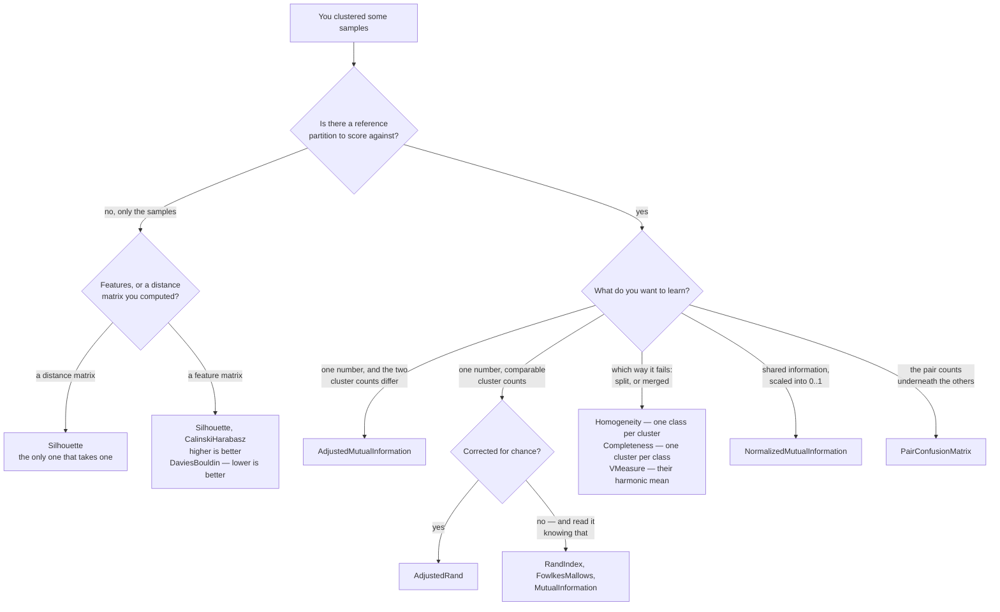

# Clustering metrics — `Lodestar.Metrics`

You clustered some samples. Most of the types on this page score the result against a **reference
partition** — labels from a human, from an earlier model, or from a dataset that came with them —
and none of them cares what the clusters are *called*: swapping the names of two clusters changes
nothing, which is exactly what separates these from the classification metrics.

Three of them need no reference at all, and score a clustering from the samples themselves. They
take a feature matrix rather than two label vectors, and they are what you reach for when there is
nothing to compare against — choosing how many clusters to ask for, for instance. They have their
own section below.

The reference-partition metrics disagree on what "agree" means, and the disagreement is the
reason there are several.

- **Corrected for chance or not.** Split every sample into a cluster of its own and
  [`Homogeneity`](clustering/homogeneity.md) scores a perfect `1`, because every cluster does hold
  one class. [`AdjustedRand`](clustering/adjustedrand.md) scores `0` on the same input, because that
  is what random labelling achieves. When a clustering looks suspiciously good, this is the pair to
  read together.
- **Symmetric or not.** [`Homogeneity`](clustering/homogeneity.md) and
  [`Completeness`](clustering/completeness.md) are the same measurement with the two labellings
  exchanged, and they pull in opposite directions: splitting raises one and merging raises the
  other. [`VMeasure`](clustering/vmeasure.md) is their harmonic mean, for when you want one number.

**The degenerate cases answer surprisingly, and it is deliberate.** An empty input scores `1` on
every metric here — agreeing about nothing is agreeing — and so does a single sample. Two
independent partitions of four samples score `-0.5` on `AdjustedRand`, not `0`: the correction for
chance is a subtraction, and it can go below zero. Every one of those numbers is scikit-learn's,
measured against 1.9.1 and frozen in the oracle corpus rather than reasoned about.

## Which one do I want?

**Corrected for chance is the branch to get right**, and it is the one above that costs most when
missed: the uncorrected three are easy to reach for by name and rarely what is wanted. The
paragraph above has the worked case — a clustering that scores a perfect `1` on `Homogeneity` and
`0` on `AdjustedRand` for the same input.

| Type | What it measures |
| --- | --- |
| [`AdjustedRand`](clustering/adjustedrand.md) | How many pairs of samples the two partitions agree about, minus what chance would give. |
| [`RandIndex`](clustering/randindex.md) | The same pair count as `AdjustedRand`, uncorrected for chance. |
| [`MutualInformation`](clustering/mutualinformation.md) | Shared information between the two labellings, unnormalised and in nats. |
| [`PairConfusionMatrix`](clustering/pairconfusionmatrix.md) | The four pair counts `AdjustedRand` and `RandIndex` are both built from. |
| [`AdjustedMutualInformation`](clustering/adjustedmutualinformation.md) | Shared information between the two labellings, minus what chance would give — the one to use across different cluster counts. |
| [`FowlkesMallows`](clustering/fowlkesmallows.md) | The geometric mean of pair precision and pair recall, uncorrected for chance. |
| [`Completeness`](clustering/completeness.md) | Whether every sample of one class landed in the same cluster. |
| [`Homogeneity`](clustering/homogeneity.md) | Whether each cluster holds samples of a single class. |
| [`NormalizedMutualInformation`](clustering/normalizedmutualinformation.md) | How much knowing one labelling tells you about the other, scaled into `[0, 1]`. |
| [`VMeasure`](clustering/vmeasure.md) | Homogeneity and completeness as one number, their harmonic mean. |

## Scoring a clustering with no reference

These three read the samples, not a second labelling. All of them refuse a label count outside
`[2, n - 1]` with the same sentence — one cluster leaves nothing to compare against, one cluster per
sample leaves nothing inside one — and none of them ever answers a non-finite value on an input
scikit-learn accepts.

**They do not all read in the same direction.** A clustering that improves moves
[`Silhouette`](clustering/silhouette.md) and [`CalinskiHarabasz`](clustering/calinskiharabasz.md)
**up** and [`DaviesBouldin`](clustering/daviesbouldin.md) **down**. Reading a table of the three
without knowing that gets one of them backwards.

Only [`Silhouette`](clustering/silhouette.md) accepts a distance matrix you computed yourself. The
other two read cluster centroids, which a distance matrix does not carry, so a reader arriving from
`silhouette_score(metric='precomputed')` will look for the equivalent and find none — the reference
has none either.

| Type | What it measures | Direction |
| --- | --- | --- |
| [`Silhouette`](clustering/silhouette.md) | How well each sample sits in its own cluster rather than the nearest other one. | higher is better |
| [`CalinskiHarabasz`](clustering/calinskiharabasz.md) | How far the clusters sit from each other against how spread they are inside. | higher is better |
| [`DaviesBouldin`](clustering/daviesbouldin.md) | The worst pairing each cluster is in, averaged. | **lower** is better |
