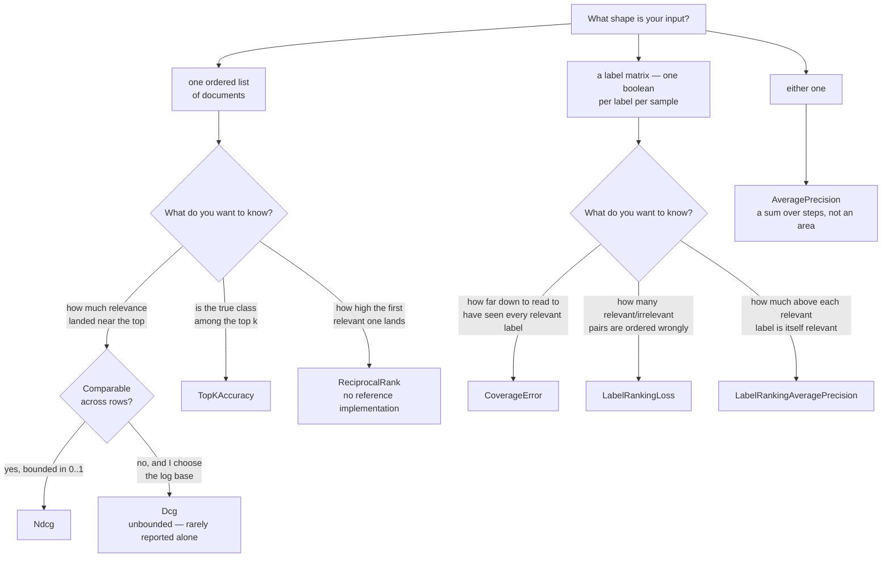

# Ranking metrics — `Lodestar.Metrics`

You have an ordered list — search results, recommendations, retrieved passages, or the labels a
multi-label classifier put a score on — and a judgement of how relevant each item actually was.
Every type on this page scores that ordering, and what
separates them from the classification metrics is that *position matters*: the same set of documents
scores differently depending on where in the list the good ones landed.

The page has three parts, and they take different input. The four types of the first table score
**one ordered list** of documents against a relevance judgement. The three of the second score a
**label matrix** — one boolean per label per sample, which is the shape a multi-label classifier
answers in — and everything said about ties above them does not apply to them, for the reason the
second half opens with. The last takes either shape.

Seven of the eight reproduce scikit-learn exactly. The eighth,
[`ReciprocalRank`](ranking/reciprocalrank.md), does not, and says so on its own page.

## Which one do I want?

**Two leaves carry a warning the branch cannot.**
[`ReciprocalRank`](ranking/reciprocalrank.md) is the one member of this package with no reference
to freeze against — [decision 0005](../../decisions/0005-the-proof-standard-and-the-oracle-each-family-is-frozen-from.md)
says what would retire that. And [`AveragePrecision`](ranking/averageprecision.md) sums the steps
of the precision-recall curve where `auc(recall, precision)` takes its area, which is a different
number on the same input, not a rounding of it — the section at the foot of this page has both.

The rest of this page is the properties behind those branches: how the gains are shaped, what
happens to ties, and why `Dcg` takes a `logBase` that `Ndcg` does not.

## The gains are linear, and much of the literature's are not

`Σ relevance / log(rank + 1)` is what [`Dcg.Score`](ranking/dcg-score.md) computes — the relevance
enters the sum as it was given. A large part of the information-retrieval literature, and several
other libraries, use `2^relevance − 1` instead, which rewards a single highly relevant document far
more steeply. Neither is wrong; they are different definitions, and a reader checking a number
against a paper will find the other one. Measured, the row `relevance = [3, 2, 1, 0]` ranked
perfectly scores `4.7618…` linearly and `9.3927…` exponentially. This page follows scikit-learn,
because everything else in this package does.

## Ties are averaged, not broken

Two documents with the same score have no order, and ranking them by the order they happened to
arrive in makes the metric depend on something the model never said. scikit-learn averages the
discounted gain over every permutation of a tied group, and that is the default here too. It has a
closed form — within a group, the mean relevance is what each position sees on average, so the group
contributes that mean times the sum of the discounts of the positions it occupies — so nothing is
enumerated and the cost is the same.

The difference is not decoration. On a row whose four scores are all equal,
[`Ndcg.Score`](ranking/ndcg-score.md) returns `0.8069…` averaged and `0.6138…` with
`ignoreTies: true`, a 30% gap on the same input. `ignoreTies` is faster and is what you want when
the scores are continuous and genuine ties cannot occur.

**On a row that does have ties, `ignoreTies` is not a parity claim on either side.** scikit-learn
reaches that path through a bare `np.argsort`, whose default is an unstable quicksort, so the order
it gives a tied group is not defined by anything. The order here *is* defined — equal scores rank by
descending index, which is what `top_k_accuracy_score`'s explicit `kind="mergesort"` gives, and what
[`TopKAccuracy.Score`](ranking/topkaccuracy-score.md) needs to agree with scikit-learn exactly. The
two coincide on every row of the frozen corpus; that they coincide on a wider one is luck, not a
guarantee, and it is the reason `ignoreTies` defaults to `false`.

## `Dcg` takes a `logBase` and `Ndcg` does not

That mirrors the reference's own surface, and the reason is arithmetic rather than taste: the
discount cancels in `Ndcg`'s ratio only when both halves share a base, so exposing it there would
offer a parameter that changes nothing. `Dcg` is unbounded above and grows with the relevance
values, which is why it is rarely reported on its own; `Ndcg` divides by the best that row could
have scored and lands in `[0, 1]`.

**Two degenerate cases answer deliberately.** A row where nothing is relevant scores `0` on
[`Ndcg.Score`](ranking/ndcg-score.md) rather than dividing by zero, and a `k` past the end of the
row is not an error — it scores the whole row, which is what `k` past the label count means. A row
of fewer than two documents *is* refused, in scikit-learn's own sentence.

## One ordered list, four types

| Type | What it measures |
| --- | --- |
| [`Dcg`](ranking/dcg.md) | How much relevance the ranking puts near the top, discounted by position. |
| [`Ndcg`](ranking/ndcg.md) | The same, divided by the best that row could have scored — `[0, 1]`. |
| [`ReciprocalRank`](ranking/reciprocalrank.md) | How high the first relevant document lands, averaged over queries. **No reference implementation.** |
| [`TopKAccuracy`](ranking/topkaccuracy.md) | How often the true class is among the highest-scoring few. |

## A label matrix, and the rank as a count

The three types below take a boolean per label per sample rather than a relevance per document, and
they rank by *counting* rather than by ordering: a label's rank is how many labels score at least as
high as it does, which is `rankdata(-y_score, "max")` — `1` is the best score, and every member of a
tied group takes the group's worst rank. Nothing observes the order inside a tie, because no such
order is ever produced, so the three paragraphs above about averaging over the permutations of a
tie, and about `ignoreTies` not being a parity claim, have nothing to say here. Permuting a tied
group cannot move any of these three numbers, at any width.

What ties do change is the value, in one place: for
[`LabelRankingLoss`](ranking/labelrankingloss.md) an irrelevant label sharing a relevant one's score
counts as outranking it, so a row whose scores are all equal scores `1` rather than `0.5`.

The three do not validate their input alike, and that is the reference's inconsistency rather than
this library's: `label_ranking_average_precision_score` scores a single label column and returns
`1`, while `coverage_error` and `label_ranking_loss` refuse it with "binary format is not
supported". The same split shows up in a weight vector summing to zero: `NaN` from the average
precision, which divides by the weight sum directly, and an exception from the other two, which go
through `numpy.average`. Each page says so next to the number it affects.

| Type | What it measures |
| --- | --- |
| [`CoverageError`](ranking/coverageerror.md) | How far down the labels you must read to have seen every relevant one. A row with none contributes `0`, so the mean can sit below `1`. |
| [`LabelRankingAveragePrecision`](ranking/labelrankingaverageprecision.md) | How much of the ranking above each relevant label is itself relevant — `[0, 1]`, `1` is perfect. |
| [`LabelRankingLoss`](ranking/labelrankingloss.md) | The fraction of (relevant, irrelevant) label pairs the ranking ordered wrongly — `[0, 1]`, `0` is perfect. |

## Either shape, and a sum rather than an area

[`AveragePrecision`](ranking/averageprecision.md) belongs to neither table cleanly: it takes one
ordered list of samples, as the first four do, **and** a label matrix, as the last three do,
averaging over the columns of one. What it does not share with the three above is the rank as a
count — it walks the samples in score order and accumulates, so a tied group is consumed at once
rather than ranked, and `rankdata` has nothing to say about it.

The number it reports is a **sum over the steps** of the precision-recall curve, not the area under
that curve. The trapezoid interpolates between two thresholds as though the curve were straight
there and comes out optimistic: `0.8333…` against `0.7916…` on the worked binary case, and `0.5`
against `0.75` on a row whose scores are all tied. The frozen corpus carries both numbers for every
binary case, so a test can hold the two apart rather than a reader having to.

| Type | What it measures |
| --- | --- |
| [`AveragePrecision`](ranking/averageprecision.md) | How much of the top of the ranking is positive, summed across the thresholds where recall moves. |
