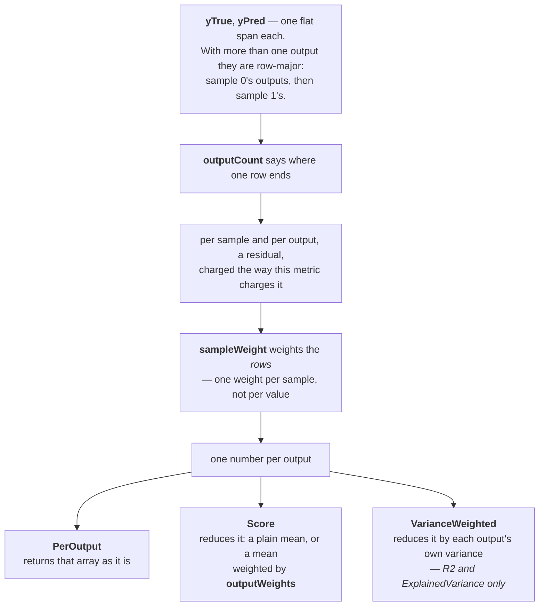
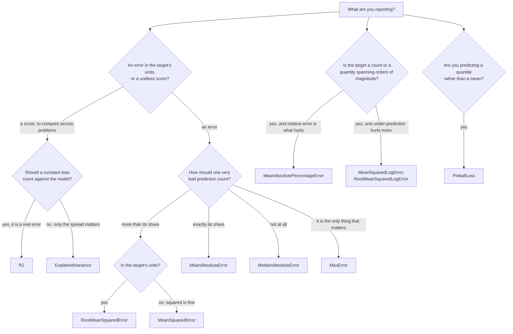

# Regression metrics — `Lodestar.Metrics`

Your model predicted a number and the truth was a different number. How wrong is that? Every type on
this page answers it, and they disagree about what "wrong" should cost. Squaring the miss makes one
bad prediction dominate; taking the median makes it disappear entirely; dividing by the truth makes
being 1 out on 10 as bad as being 100 out on 1000. None of these is the correct answer — the right
one is the one that matches what a mistake actually costs you — and reporting the wrong one is the
usual reason a model that looks good on a metric behaves badly in use.

Two families sit here, and it is worth knowing which one you are reading.

- An **error** — everything with `Error` or `Loss` in its name — is `0` when the prediction is
  perfect and grows without bound. It is in the units of your target, or their square, so `0.5` means
  nothing until you know what the target was measured in.
- A **score** — `R2` and `ExplainedVariance` — is `1` when the prediction is perfect, `0` for a model
  no better than always predicting the mean, and **negative** for one that is worse than that. It is
  unitless, so it can be compared across problems, which is precisely what an error cannot do.

## How the parameters fit together

Everything here except `MaxError` shares one shape, and reading it once saves reading it sixteen
times. The three deviances read it with one parameter more — a `power` that moves the domain of
validity as well as the formula — and `TweedieDeviance` has that table.

`outputCount` defaults to `1`, which is the ordinary case: one target per sample, one number out.
There is no two-dimensional overload because a `ReadOnlySpan<T>` cannot carry one, and `PerOutput`
is a method rather than an enum member because it changes the return type —
the multioutput rule.

Two refusals every metric here shares, both reproducing the message their Python layer prints. A
`sampleWeight` that is zero **throughout** is refused — the rule is every weight, not the sum, so
`[-1, -2, -3]` still scores — and `outputWeights` whose **sum** is zero are refused, so `[1, -1]` is
refused and `[-1, -1]` scores. Both arrive as `ArgumentException`. Non-finite values in `yTrue` or
`yPred` are refused too.

Classification metrics — how often a label was right — are on the
[classification page](classification.md), not here. `ZeroDivision`, which `R2` takes, is documented
there.

## Which one do I report?

| Type | What it measures |
| --- | --- |
| [`ExplainedVariance`](regression/explainedvariance.md) | The share of the truth's spread the prediction accounts for, ignoring a constant bias. |
| [`MaxError`](regression/maxerror.md) | The single worst prediction, and nothing else. |
| [`MeanAbsoluteError`](regression/meanabsoluteerror.md) | The average miss, in the target's own units. |
| [`MeanAbsolutePercentageError`](regression/meanabsolutepercentageerror.md) | The average miss as a fraction of the truth. |
| [`MeanSquaredError`](regression/meansquarederror.md) | The average squared miss — the one big errors dominate. |
| [`MeanSquaredLogError`](regression/meansquaredlogerror.md) | The same, on `log(1 + y)`, so a ratio matters more than a difference. |
| [`MedianAbsoluteError`](regression/medianabsoluteerror.md) | The typical miss, immune to any number of outliers. |
| [`PinballLoss`](regression/pinballloss.md) | The loss for a quantile prediction, charging over- and under-shooting differently. |
| [`R2`](regression/r2.md) | How much better than always predicting the mean, as a unitless score. |
| [`RootMeanSquaredError`](regression/rootmeansquarederror.md) | `MeanSquaredError` back in the target's units. |
| [`RootMeanSquaredLogError`](regression/rootmeansquaredlogerror.md) | `MeanSquaredLogError` back in log units. |
| [`TweedieDeviance`](regression/tweediedeviance.md) | The deviance a squared error becomes when the target is not normally distributed. |
| [`PoissonDeviance`](regression/poissondeviance.md) | `TweedieDeviance` at power 1 — the deviance for a count. |
| [`GammaDeviance`](regression/gammadeviance.md) | `TweedieDeviance` at power 2 — scale-invariant, for a positive quantity. |
| [`D2Tweedie`](regression/d2tweedie.md) | What share of a deviance the model explains, against a constant baseline. |
| [`D2Pinball`](regression/d2pinball.md) | The same for a quantile prediction, against the best constant quantile. |
| [`D2AbsoluteError`](regression/d2absoluteerror.md) | `D2Pinball` at the median — `R2`'s question with an outlier-proof baseline. |
