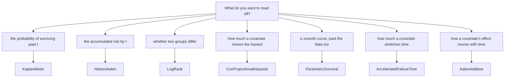

# Survival estimators — `Lodestar.Survival`

A duration and whether it ended in the event. That pair, one per subject, is what every
estimator here takes, and it is the whole of what survival analysis needs to say something a
mean cannot.

## The problem censoring creates

A subject who leaves the study at month 20 without the event has not survived 20 months — they
have survived *at least* 20 months. Averaging durations throws that away, and dropping the
subject throws away more. **Right censoring** is a subject whose duration is a lower bound, and
the three estimators below are the ones that use it rather than discard it.

The Cox proportional hazards model adds covariates: by how much each changes the hazard. The
parametric fits trade the data's own shape for a smooth one — Weibull, log-normal and the rest — and
the accelerated failure time regressions put covariates on that shape, stretching or shrinking time.
Both take **left censoring**, a duration that is an upper bound, **interval censoring**, an event
known to lie between two visits, and **delayed entry**, a subject watched only from some time on;
[`KaplanMeier.EstimateLeftCensored`](estimators/kaplanmeier-estimateleftcensored.md) and
[`BreslowFlemingHarrington`](estimators/breslowflemingharrington.md) take the first and the last
respectively, without a model. Turnbull's non-parametric estimate for interval-censored data is not here.

## Which estimator?

`KaplanMeier` and `NelsonAalen` are two readings of one table, and they share a timeline by
construction — the same `SurvivalStep[]`, built once. Where they part is at the end of a sample
whose last duration is observed: survival reaches zero and can fall no further, while the hazard
keeps the size of that last step.

## What all three share

- **The pair, as spans.** `durations` and `eventObserved`, the same length, durations
  non-negative. Anything else is refused with `ArgumentException`.
- **Ties are the point, not an edge case.** A time carrying three events is not three times
  carrying one, and the two estimators differ on exactly that — see
  [`NelsonAalen.Estimate`](estimators/nelsonaalen-estimate.md).
- **Time zero is a step**, with everyone at risk and nothing having happened. It is the shape
  lifelines' own event table has, and it makes a curve plottable without a special first point.
- **Each is a static class with no state**, so all three are safe to call from any number of
  threads at once.
- **Each is checked against `lifelines` 0.30.3**, and the corpora are in
  [`tests/oracles`](../../equivalence.md).

## Types

| Type | What it is |
| --- | --- |
| [`AalenAdditive`](estimators/aalenadditive.md) | Aalen's additive hazards model, whose covariate effects move with time. |
| [`AalenOptions`](estimators/aalenoptions.md) | The level, the intercept and the two penalties an Aalen fit takes. |
| [`AalenSummary`](estimators/aalensummary.md) | What it returns: the cumulative coefficients, their bounds, the slopes and the predictions. |
| [`AcceleratedFailureTime`](estimators/acceleratedfailuretime.md) | The Weibull, log-normal and log-logistic regressions on the time axis. |
| [`AftModel`](estimators/aftmodel.md) | Which accelerated failure time regression runs. |
| [`AftOptions`](estimators/aftoptions.md) | The level, the intercept, the ancillary model, the penalty and the robust errors an AFT fit takes. |
| [`AftSummary`](estimators/aftsummary.md) | What it returns: the coefficient table, the likelihood-ratio test and the predictions. |
| [`BreslowFlemingHarrington`](estimators/breslowflemingharrington.md) | The survival function as the exponential of minus the Nelson-Aalen hazard. |
| [`Concordance`](estimators/concordance.md) | Harrell's concordance index on any predicted scores. |
| [`CoxBaseline`](estimators/coxbaseline.md) | One stratum's Breslow baseline of a Cox fit. |
| [`CoxOptions`](estimators/coxoptions.md) | The interval level, the iteration budget, the penalty and the robust variance a Cox fit takes. |
| [`CoxProportionalHazards`](estimators/coxproportionalhazards.md) | The Cox model, on Efron's partial likelihood. |
| [`CoxSummary`](estimators/coxsummary.md) | What it returns: the coefficient table, the likelihood-ratio test and the concordance. |
| [`CoxTimeTransform`](estimators/coxtimetransform.md) | The time scale of the proportional hazards test. |
| [`CoxTimeVarying`](estimators/coxtimevarying.md) | The Cox model on start-stop intervals. |
| [`KaplanMeier`](estimators/kaplanmeier.md) | The survival function, with Greenwood variance and log-log bounds. |
| [`KaplanMeierCurve`](estimators/kaplanmeiercurve.md) | What it returns: the estimate, its bounds and its steps. |
| [`LogRank`](estimators/logrank.md) | The log-rank family: two groups or more, weighted, pairwise. |
| [`LogRankOptions`](estimators/logrankoptions.md) | The weighting, its exponents and the truncation a test takes. |
| [`LogRankResult`](estimators/logrankresult.md) | What it returns: a statistic, a p-value and the degrees of freedom. |
| [`LogRankWeighting`](estimators/logrankweighting.md) | Which member of the family runs. |
| [`NelsonAalen`](estimators/nelsonaalen.md) | The cumulative hazard function. |
| [`NelsonAalenCurve`](estimators/nelsonaalencurve.md) | What it returns: the accumulated hazard and its steps. |
| [`PairwiseLogRankResult`](estimators/pairwiselogrankresult.md) | One pair of groups from the pairwise test. |
| [`ParametricFit`](estimators/parametricfit.md) | What a parametric fit returns: the parameter table and the fitted curves. |
| [`ParametricModel`](estimators/parametricmodel.md) | Which parametric model runs. |
| [`ParametricOptions`](estimators/parametricoptions.md) | The level, the iteration budget and the piecewise breakpoints a parametric fit takes. |
| [`ParametricSurvival`](estimators/parametricsurvival.md) | lifelines' six parametric fitters, right-, left- and interval-censored. |
| [`RestrictedMeanResult`](estimators/restrictedmeanresult.md) | The restricted mean survival time and its variance. |
| [`SurvivalCurve`](estimators/survivalcurve.md) | What the Breslow-Fleming-Harrington estimator returns: the estimate, its bounds and its steps. |
| [`SurvivalStep`](estimators/survivalstep.md) | One step of either curve: a time, a risk set, and what happened at it. |

## See also

- [Survival analysis](../../guides/survival-analysis.md) — the guide, with a worked trial.
- [Python → C# equivalence](../../equivalence.md) — the `lifelines` call each of these replaces.
