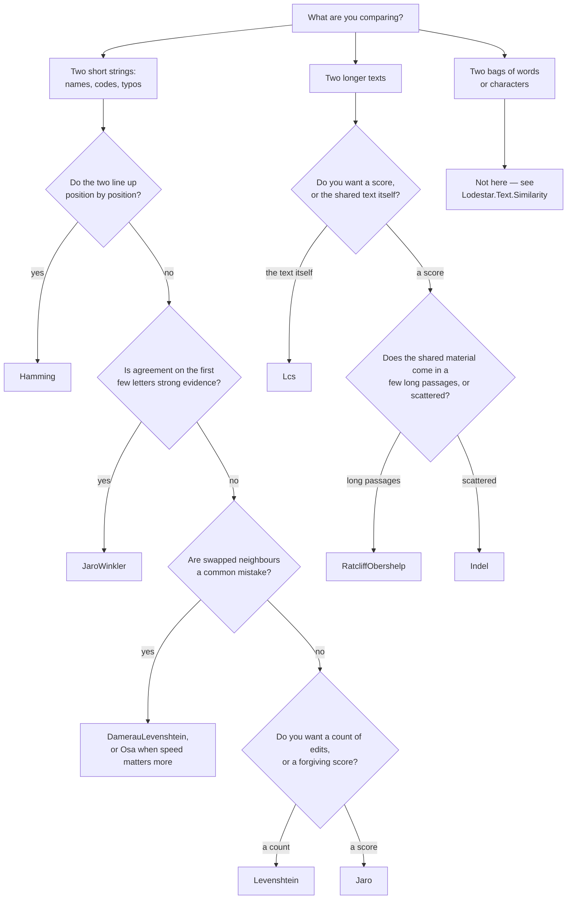

# Distances — `Lodestar.Text.Distances`

How different are two pieces of text? Every type on this page answers that, and they disagree on
what "different" means: some count the edits that turn one string into the other, some check how
many characters line up in roughly the same place, and one looks for the longest stretches the two
have in common. Picking the wrong one is the usual cause of a similarity score that looks nothing
like what a reader expects.

Two conventions run through the whole namespace, and knowing them saves reading every entry.

- A **distance** counts how far apart two inputs are: `0` means identical, and a bigger number is a
  worse match. A **similarity** runs the other way, `1` meaning identical. What decides whether a
  number can be compared across pairs of different lengths is its type, not its name: a `Distance`
  returning `int` counts edits and has no upper bound, while every member returning `double` on this
  page — the `Normalized…` ones and also `Jaro`, `JaroWinkler` and `RatcliffObershelp` — is already
  scaled to `[0, 1]` and is comparable.
- Every member that takes a `string` also takes a `TextElement` saying what counts as one character.
  (The generic overloads — `Distance<T>`, `SubsequenceLength<T>`, `SubstringLength<T>` — do not: they
  compare whatever elements you hand them.) The default,
  `TextElement.Utf16Unit`, is .NET's own unit and gives the same answer as Python for every
  character in the Basic Multilingual Plane. Outside it — emoji, rare ideographs — one character is
  two UTF-16 units, and the two disagree on purpose; pass `TextElement.CodePoint` for Python's
  answer. The reasoning is in [decision 0001](../../decisions/0001-the-foundations-target-frameworks-comparison-unit-persistence-and-versioning.md).

Comparing two **bags** of words or characters, where position does not matter at all, is a
different question. It is answered by the [`Lodestar.Text.Similarity`](similarity.md) namespace —
`Jaccard`, `SorensenDice`, `Overlap`, `Tversky` and `Cosine` — not by anything here.

## Which one do I want?

| Type | What it measures |
| --- | --- |
| [`DamerauLevenshtein`](distances/dameraulevenshtein.md) | Insertions, deletions, substitutions and swaps of neighbouring characters, with no limit on re-editing a stretch. |
| [`Hamming`](distances/hamming.md) | How many positions hold a different character, plus the difference in length. |
| [`Indel`](distances/indel.md) | Insertions and deletions only, never substitutions — the basis of rapidfuzz's `fuzz.ratio`. |
| [`IndelPattern`](distances/indelpattern.md) | The same measure with one pattern's table built once, for a caller holding a list of texts. |
| [`Jaro`](distances/jaro.md) | How many characters the two share near the same position, and how many of those arrive out of order. |
| [`JaroWinkler`](distances/jarowinkler.md) | `Jaro`, raised for pairs that already agree on their first few characters. |
| [`Lcs`](distances/lcs.md) | The length of the longest run the two have in common, contiguous or not. |
| [`Levenshtein`](distances/levenshtein.md) | Insertions, deletions and substitutions. |
| [`Osa`](distances/osa.md) | The same as `DamerauLevenshtein`, except that no stretch of text may be edited twice. |
| [`RatcliffObershelp`](distances/ratcliffobershelp.md) | How much of the two texts their matching blocks cover, taken longest first. |
