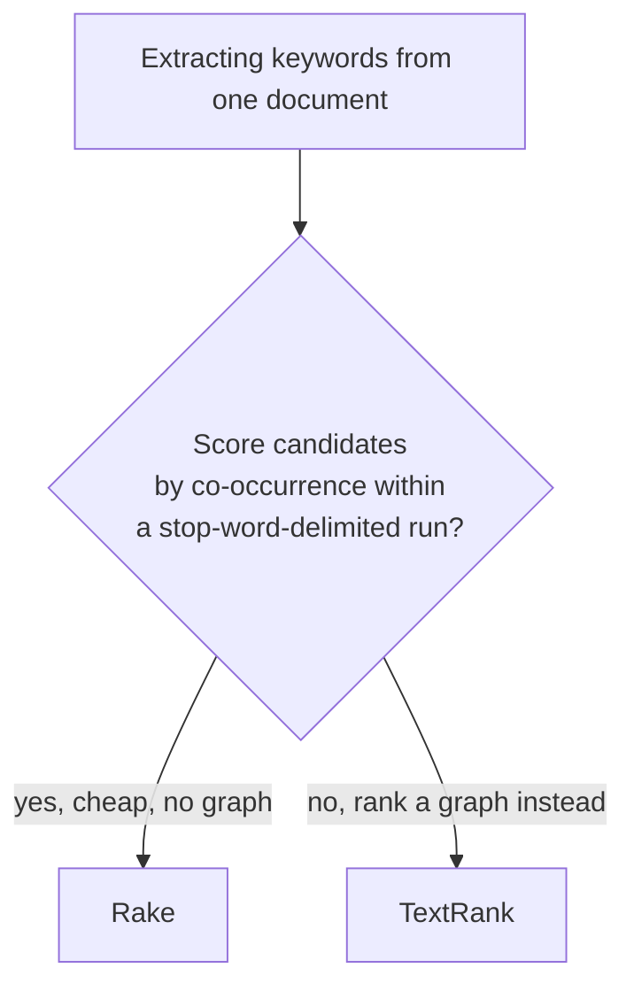

# Keyword extraction — `Lodestar.Text.Keywords`

Two ways to pull the words that matter out of a document, and neither reads the document twice to
do it — the score comes out of the same graph or the same run table that finds the candidates in
the first place.

`Rake` and `TextRank` disagree on what a candidate even is. `Rake` treats a document as runs of
words separated by stop words and punctuation, and scores a run by how often its words occur and
how much they co-occur with other words — no order, no neighbours outside the run itself.
`TextRank` treats it as a graph: every word (after stop words are dropped) is a node, an edge joins
words that stood near each other, and the score is that graph's dominant eigenvector — the same
family of algorithm PageRank uses on links.

Both return `IReadOnlyList<KeywordMatch>`, sorted by descending score — the scale is each
extractor's own and is not comparable between them. Neither downloads a stop-word list or a model:
`RakeOptions.StopWords` and `TextRankOptions.StopWords` take what you supply and default to
`StopWords.English`, already in the assembly ([decision 0005](../../decisions/0005-the-proof-standard-and-the-oracle-each-family-is-frozen-from.md)).

## Types

| Type | What it is |
| --- | --- |
| [`KeywordMatch`](keywords/keywordmatch.md) | One extracted phrase and the score that ranked it. |
| [`Rake`](keywords/rake.md) | Rapid Automatic Keyword Extraction over stop-word-delimited runs. |
| [`RakeMetric`](keywords/rakemetric.md) | Which per-word score `Rake` sums into a phrase score. |
| [`RakeOptions`](keywords/rakeoptions.md) | What `Rake` is built with. |
| [`TextRank`](keywords/textrank.md) | TextRank over a co-occurrence graph. |
| [`TextRankOptions`](keywords/textrankoptions.md) | What `TextRank` is built with. |

## See also

- [The keyword extraction guide](../../guides/keyword-extraction.md) — RAKE and TextRank side by side, and the
  KeyBERT-style composition with `Lodestar.Onnx` and `Lodestar.Embeddings.Search.Mmr`.
- [Python → C# equivalence](../../equivalence.md) — what this replaces on the rake-nltk and summa
  side, and the divergences each has from its reference.
