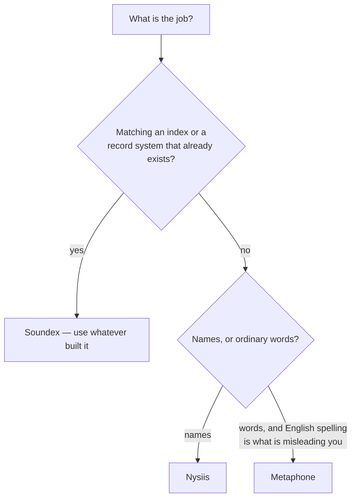

# Phonetic encoding — `Lodestar.Text.Phonetics`

`Smith` and `Smyth` are the same name. So are `Robert` and `Rupert`, to an ear if not to a
string comparison. A phonetic encoder reduces a word to a code that stands for how it sounds, so
two spellings of one name become one key and meet in an index.

`Lodestar.Text.Phonetics` holds three of them, one static class each, all with the same single
method: a word in, a code out. A fourth, [`MatchRatingApproach`](phonetics/matchratingapproach.md),
adds the one thing the other three cannot answer on their own: not just a code, but whether two
codes count as a match — its `Compare` reads a minimum-rating table keyed by both codices'
combined length, which is not something a caller can derive from either code alone.

A fifth, [`DoubleMetaphone`](phonetics/doublemetaphone.md), breaks the shape the other four share:
it returns **two** codes rather than one, so a spelling with more than one plausible reading does
not have to be forced into a single verdict. That is what lets `Smith` meet `Schmidt` without
merging every `S`-word with them.

## Which encoder?

## How coarse each one is, measured

The three are pinned on the same 402-word corpus, which makes the difference between them
countable rather than a matter of reputation:

| encoder | code | distinct codes over 402 words | words sharing a code |
| --- | --- | --- | --- |
| [`Soundex`](phonetics/soundex.md) | one letter and three digits, always 4 characters | 347 | **101** |
| [`Nysiis`](phonetics/nysiis.md) | letters, 1 to 11 characters | 395 | **13** |

[`Metaphone`](phonetics/metaphone.md) sits between them and is measured on its own corpus of 123
real words — 117 distinct codes, 1 to 6 characters — for the reason
[decision 0007](../../decisions/0007-metaphone-scope.md) gives.

**That column is the whole trade-off.** Soundex merges aggressively, so it finds spellings you did
not think of and also returns names that have nothing to do with the query. NYSIIS barely merges
at all, so what it returns is nearly always right and the one you wanted may not be in it.

## What the three disagree about

| word | Soundex | Metaphone | NYSIIS |
| --- | --- | --- | --- |
| `Robert` | `R163` | `RBRT` | `RABAD` |
| `Rupert` | `R163` | `RPRT` | `RAPAD` |
| `Knight` | `K523` | `NT` | `NAGT` |
| `Wright` | `W623` | `RT` | `WRAGT` |
| `Thomas` | `T520` | `0MS` | `TAN` |

`Robert` and `Rupert` are the textbook Soundex collision: the `b`/`p` distinction is exactly what
its digit table throws away, and the two other encoders keep it.

`Knight` and `Wright` are the opposite case. Metaphone **models English spelling**: it knows the
`k` in `Knight` and the `w` in `Wright` are silent, and drops them, so the code starts on the
sound the word starts with. Soundex and NYSIIS both key on the written first letter and file the
two words under `K` and `W`. If your data is English words rather than surnames, that difference
is usually the one that matters.

`Thomas` shows Metaphone's alphabet: `0` is "th", and `X` — as in `Christina` → `XRSTN` — is
"sh". A code is not readable, and is not meant to be.

## What all three share

- **A code is a key, not a pronunciation.** Compare codes to each other; never show one, and never
  try to read a word back out of one.
- **They are English heuristics.** None is Unicode-aware beyond case folding, and none has
  anything reliable to say about a name that is not English in origin — which includes many of
  the names a real dataset holds.
- **Non-letters are ignored, except by `MatchRatingApproach`**, which refuses one instead — see
  [its own page](phonetics/matchratingapproach.md) for why. The empty string always encodes to
  the empty string.
- **A `null` word is refused**, the same rule the [stemmers next door](stemming.md) apply —
  [decision 0042](../../decisions/0042-phonetic-encoders-refuse-a-null-word.md).
  [`Soundex.Encode`](phonetics/soundex-encode.md) shows it.
- **Each is a static class with no state**, so all four are safe to call from any number of
  threads at once.

## Types

| Type | What it is |
| --- | --- |
| [`DoubleMetaphone`](phonetics/doublemetaphone.md) | Two codes rather than one, so a name with two readings matches on either. |
| [`DoubleMetaphoneCode`](phonetics/doublemetaphonecode.md) | The pair `DoubleMetaphone.Encode` returns. |
| [`MatchRatingApproach`](phonetics/matchratingapproach.md) | A codex, and the rule for deciding whether two of them match. |
| [`Metaphone`](phonetics/metaphone.md) | English spelling modelled as sound; silent letters dropped. |
| [`Nysiis`](phonetics/nysiis.md) | The finest of the three, built for names. |
| [`Soundex`](phonetics/soundex.md) | The 1918 classic: one letter, three digits, and it merges a lot. |

## See also

- [Python → C# equivalence](../../equivalence.md) — the `jellyfish` call each of these replaces.
- [`Fuzz.Ratio`](../fuzzy/matching/fuzz-ratio.md) — the other way to decide two names match, on
  spelling rather than sound.
- [`decisions/0007`](../../decisions/0007-metaphone-scope.md) — why Metaphone is pinned on real
  words only.
