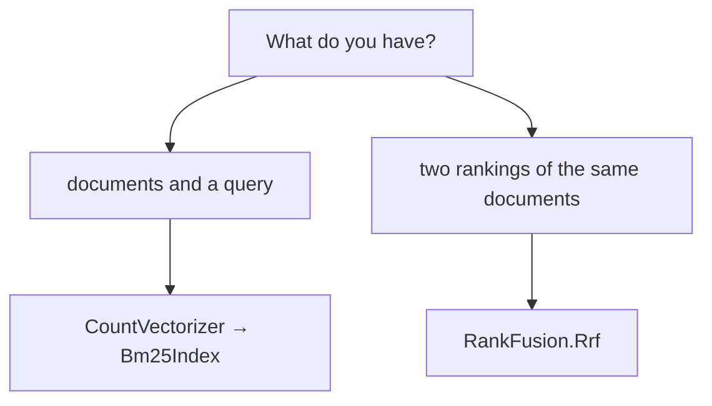

# Keyword search — `Lodestar.Text.Search`

BM25 over a document-term matrix, and a way to fuse the ranking it produces with another.

## What this is, and what it is not

This is **the formula, scored over an in-memory matrix**. It is not a search engine: there is no
index on disk, no `Directory`, no `IndexWriter`, no codec, no postings format, and no
Block-Max WAND top-k. A library that has those is a different kind of thing, and
[`LuceneSharp.Core`](https://www.nuget.org/packages/LuceneSharp.Core) is it.

What it gives you instead is BM25 over the matrix
[`CountVectorizer`](vectorizers/countvectorizer.md) already produced, with no new dependency and
nothing to build or persist. If the corpus fits in memory, that is the whole of it.

**Score the raw-count matrix, never a TF-IDF one.** BM25's saturation and length normalization
replace TF-IDF's; scoring an already-weighted matrix applies two weightings and the numbers mean
nothing.

## Which piece?

`RankFusion.Rrf` is what makes a hybrid search: fuse the BM25 ranking with a vector one from
[`EmbeddingIndex`](../../guides/embeddings.md) and neither side needs to know the other's scale.

## What to know before reading a score

- **The scale is BM25's**, and is not comparable across corpora, across queries, or against a
  cosine similarity. Only the ordering within one query means anything.
- **A score can be negative.** Robertson's IDF goes negative for a term in more than half the
  corpus, and the floor this package applies is itself negative when the mean IDF is — see
  [`Bm25Idf`](search/bm25idf.md).
- **The default `K1` is 1.5**, which is `rank_bm25`'s, not the 1.2 Lucene defaults to.
- **Each is checked against `rank_bm25` 0.2.2**, except `RankFusion`, which has no canonical
  library and is pinned by tests stating Cormack et al.'s formula.

## Types

| Type | What it is |
| --- | --- |
| [`Bm25Idf`](search/bm25idf.md) | Which inverse document frequency to weight by. |
| [`Bm25Index`](search/bm25index.md) | BM25 scored over a matrix of raw counts. |
| [`Bm25Options`](search/bm25options.md) | The saturation, length normalization and IDF. |
| [`RankFusion`](search/rankfusion.md) | Reciprocal rank fusion over two or more rankings. |
| [`SearchHit`](search/searchhit.md) | One document and the score that ranked it. |

## See also

- [Keyword search](../../guides/keyword-search.md) — the guide, with a worked hybrid ranking.
- [Python → C# equivalence](../../equivalence.md) — the `rank_bm25` call this replaces.
