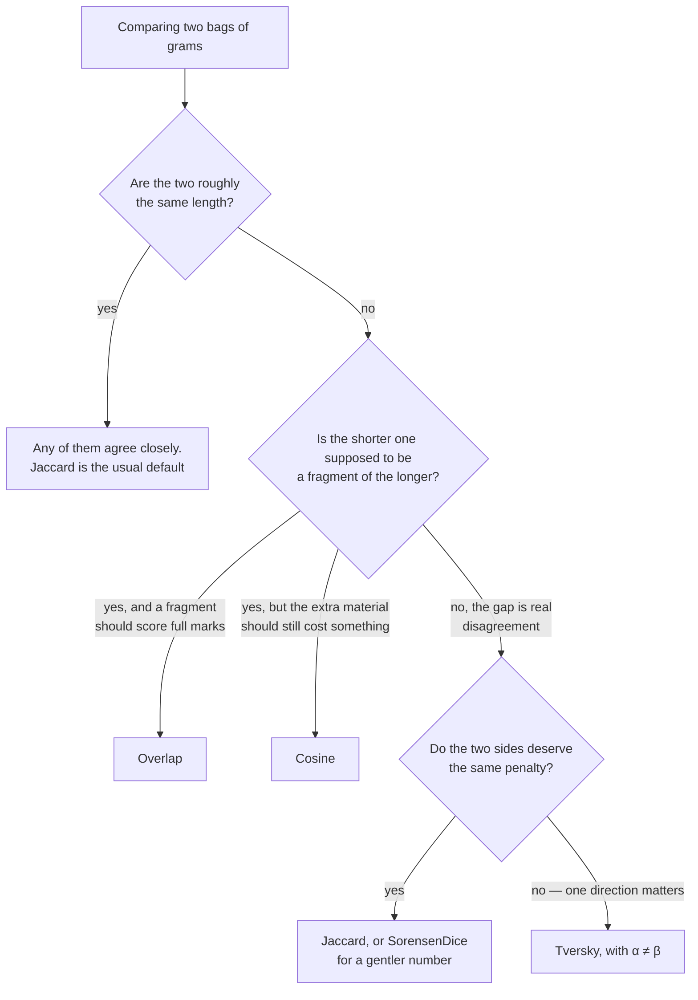

# Set similarity — `Lodestar.Text.Similarity`

How much do two pieces of text have **in common**, when where it appears does not matter? Every
type on this page answers that. They cut each input into q-grams, count them as a bag, and divide
the grams the two share by something — and the something is the only place they disagree.

Two conventions run through the whole namespace, and knowing them saves reading every entry.

- A q-gram is a run of `qval` consecutive characters, and `qval` is `1` by default, which makes the
  grams individual characters. Repeats count: `"apple"` holds `p` **twice**, and a bag that holds it
  once shares only one of them. This is `textdistance`'s reading, and the reason a caller who wants
  words rather than characters has to split and compare the pieces themselves.
- Every member takes a `TextElement` saying what counts as one character. The default,
  `TextElement.Utf16Unit`, is .NET's own unit and agrees with Python for every character in the
  Basic Multilingual Plane; outside it — emoji, rare ideographs — one character is two UTF-16 units
  and the two disagree on purpose. Pass `TextElement.CodePoint` for Python's answer. The reasoning
  is in [decision 0002](../../decisions/0002-unicode-comparison-unit.md).

Comparing text **position by position** — how many edits turn one string into the other, whether
two names are spelled alike — is a different question, answered by
[`Lodestar.Text.Distances`](distances.md) and not by anything here.

## One numerator, five denominators

Every measure on this page divides `|A∩B|`, the grams the two bags share, by a denominator of its
own. That is the entire difference between them, and it is enough to predict which will disagree
with which.

| Type | Denominator | What that makes it do |
| --- | --- | --- |
| [`Jaccard`](similarity/jaccard.md) | `\|A∪B\|` | Charges for every gram either side holds alone. The strictest of the five. |
| [`SorensenDice`](similarity/sorensendice.md) | `(\|A\| + \|B\|) / 2` | Counts shared grams twice, so it always reads higher than `Jaccard`. |
| [`Overlap`](similarity/overlap.md) | `min(\|A\|, \|B\|)` | Ignores the size gap entirely: `1` whenever one bag is contained in the other. |
| [`Cosine`](similarity/cosine.md) | `√(\|A\| · \|B\|)` | Between the other three — the geometric mean punishes a size gap, but gently. |
| [`Tversky`](similarity/tversky.md) | `\|A∩B\| + α·\|A\B\| + β·\|B\A\|` | The general form the others are cases of, and the only asymmetric one. |

Two consequences are worth having before you choose.

**`Jaccard` and `SorensenDice` rank identically.** `Dice = 2·Jaccard / (1 + Jaccard)`, which rises
with `Jaccard` over the whole of `[0, 1]`, so sorting candidates by one produces the order the
other would. Choosing between them changes the number a threshold has to be set against, never
which match wins.

**`Tversky` is the other four in disguise.** `α = β = 1` is `Jaccard`, `α = β = 0.5` is
`SorensenDice`, and the asymmetric settings are what the other four cannot express: `α = 1, β = 0`
charges only for what the *first* input holds alone, which asks "is A contained in B" rather than
"do A and B agree".

## Which one do I want?

| Type | What it measures |
| --- | --- |
| [`Cosine`](similarity/cosine.md) | Shared grams over the geometric mean of the two bag sizes — the Ochiai coefficient. |
| [`Jaccard`](similarity/jaccard.md) | Shared grams over the grams either side holds at all. |
| [`Overlap`](similarity/overlap.md) | Shared grams over the smaller bag, so containment scores `1`. |
| [`SorensenDice`](similarity/sorensendice.md) | Shared grams counted twice, over the two bag sizes added. |
| [`Tversky`](similarity/tversky.md) | Shared grams against the two sides' surpluses, weighted separately. |

## Sketches, for when the corpus is too big to compare pair by pair

The five measures above compare **two** inputs exactly. A corpus of a million documents holds half
a trillion pairs, and no exact measure survives that. The four types below trade exactness for a
sketch that fits in a few hundred bytes and a lookup that never sees most pairs.

| Type | What it measures |
| --- | --- |
| [`MinHash`](similarity/minhash.md) | Jaccard over a **set**, estimated from one minimum per permutation. |
| [`MinHashPermutations`](similarity/minhashpermutations.md) | The coefficients a signature is built from, supplied rather than seeded. |
| [`SimHash`](similarity/simhash.md) | Cosine over a **weighted bag**, as one 64-bit fingerprint. |
| [`LshBanding`](similarity/lshbanding.md) | How a signature is cut into bands, and the solve that picks the cut. |
| [`LshIndex`](similarity/lshindex.md) | Candidates sharing a band, so a query never scans the corpus. |

**Set or bag is the choice that matters**, and it is not a matter of taste. `MinHash` takes a
minimum, which is idempotent, so a token repeated changes nothing; `SimHash` sums weights, so it
does. Deduplicating near-identical documents wants the bag; comparing sets of tags or shingles
wants the set.

Both are **estimates**, and both return candidates rather than answers — which is why
[`Jaccard`](similarity/jaccard.md) above stays the right call whenever the two inputs are in hand
and small enough to compare directly.

## What every one of them does with an empty input

Two empty inputs share nothing and disagree about nothing, and all five answer `1` — the reference
libraries' choice, kept here so a ported comparison does not change at the boundary. One empty
input against a non-empty one answers `0` everywhere except [`Tversky`](similarity/tversky.md),
whose weights can make the denominator vanish; its entry says when.

**See also** — [distances](distances.md) for position-sensitive comparison, the
[Python equivalence table](../../equivalence.md), and
[`Lodestar.Fuzzy`](../fuzzy/matching.md) for scorers that do the token splitting for you.
