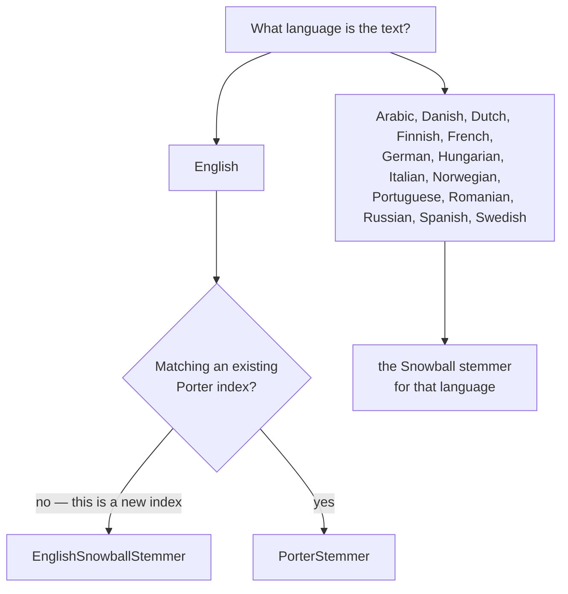

# Stemming — `Lodestar.Text.Stemming`

`ran`, `running` and `runs` are three spellings of one idea, and an index that stores them as
three terms cannot match a query that uses the fourth. A stemmer cuts each word down to a shared
key so they collide on purpose.

`Lodestar.Text.Stemming` holds sixteen stemmers, one static class each, all with the same single
method: a `string` in, a `string` out.

## Which stemmer?



Language picks the stemmer, and for fifteen of the sixteen that is the whole decision. A stemmer is
built from one language's suffix rules and has nothing sensible to say about another's:
[`GermanSnowballStemmer.Stem`](stemming/germansnowballstemmer-stem.md) applied to French returns
*something*, and that something is noise.

## The one real choice: Porter or Porter2

English has two, and they are the same algorithm a generation apart.
[`PorterStemmer.Stem`](stemming/porterstemmer-stem.md) is Martin Porter's 1980 original;
[`EnglishSnowballStemmer.Stem`](stemming/englishsnowballstemmer-stem.md) is his own later revision,
published as Snowball and universally called Porter2.

**Porter2 is the one to reach for.** It is Porter's own later revision, so where the two disagree
it is the original being corrected. Over the 86 words both are pinned on, they disagree six times,
and Porter2 trims less in five of the six:

| word | Porter | Porter2 |
| --- | --- | --- |
| `ties` | `ti` | `tie` |
| `fairly` | `fairli` | `fair` |
| `communism` | `commun` | `communism` |
| `generalization` | `gener` | `general` |
| `formative` | `form` | `format` |
| `homologou` | `homolog` | `homologou` |

`generalization` is the clearest of them: Porter trims all the way to `gener`, a fragment short
enough that several unrelated words reach it. Porter2 stops at `general`, which still names
something.

The reason to choose the original anyway is **compatibility, not quality**. An index built by
Porter has to be queried by Porter, and a corpus already stemmed one way cannot be searched the
other. That is the whole of the case for it.

```csharp
using Lodestar.Text.Stemming;

string old = PorterStemmer.Stem("generalization");    // => gener
string current = EnglishSnowballStemmer.Stem("generalization");  // => general
```

## What a stem is not

A stem is a **key, not a word**. `musico`, `musica`, `musicos` and `musicas` all stem to `music`,
and Spanish `cantar` stems to `cant` — which is not Spanish. The output is meant to be compared
against other output, never shown to a reader.

This is what separates stemming from lemmatisation, which returns the dictionary form and needs a
dictionary to do it. Nothing here carries one: these are rule engines, small and fast, and they
are wrong on irregular words by construction. `Lodestar` ships no lemmatiser.

The consequence for a search index is that both sides must be stemmed by the same stemmer — the
documents when they are indexed, the query when it arrives. Stem one and not the other and the
keys never meet.

## What all fifteen share

- **Input is lowercased first.** The algorithms are defined on lowercase, so `Running` and
  `running` give the same stem, and the result is always lowercase.
- **A null word is refused**, with `ArgumentNullException`. An empty string is not: it comes back
  empty.
- **Each is a static class with no state**, so all fifteen are safe to call from any number of
  threads at once.
- **Each is checked word for word against a Python reference**, and the corpora are in
  [`tests/oracles`](../../equivalence.md). Where a stem looks wrong, it is wrong in the same way
  the reference is. That reference is nltk for thirteen of the fourteen and `snowballstemmer` for
  Hungarian — [decision 0091](../../decisions/0091-hungarian-takes-snowballstemmer-as-its-oracle.md)
  has why.

## Types

| Type | What it is |
| --- | --- |
| [`ArabicSnowballStemmer`](stemming/arabicsnowballstemmer.md) | Arabic Snowball — the one right-to-left script, and the one with no R1 or R2. |
| [`DanishSnowballStemmer`](stemming/danishsnowballstemmer.md) | Danish Snowball. |
| [`DutchSnowballStemmer`](stemming/dutchsnowballstemmer.md) | Dutch Snowball. |
| [`EnglishSnowballStemmer`](stemming/englishsnowballstemmer.md) | English Porter2 — the one to use for new English text. |
| [`FinnishSnowballStemmer`](stemming/finnishsnowballstemmer.md) | Finnish Snowball — the longest of them, and the only one with vowel harmony. |
| [`FrenchSnowballStemmer`](stemming/frenchsnowballstemmer.md) | French Snowball. |
| [`GermanSnowballStemmer`](stemming/germansnowballstemmer.md) | German Snowball. |
| [`HungarianSnowballStemmer`](stemming/hungariansnowballstemmer.md) | Hungarian Snowball. |
| [`ItalianSnowballStemmer`](stemming/italiansnowballstemmer.md) | Italian Snowball. |
| [`NorwegianSnowballStemmer`](stemming/norwegiansnowballstemmer.md) | Norwegian Snowball (Bokmål). |
| [`PorterStemmer`](stemming/porterstemmer.md) | English Porter (1980), for compatibility with an existing index. |
| [`PortugueseSnowballStemmer`](stemming/portuguesesnowballstemmer.md) | Portuguese Snowball. |
| [`RomanianSnowballStemmer`](stemming/romaniansnowballstemmer.md) | Romanian Snowball — the one Romance language of the later nine. |
| [`RussianSnowballStemmer`](stemming/russiansnowballstemmer.md) | Russian Snowball — the one Cyrillic alphabet. |
| [`SpanishSnowballStemmer`](stemming/spanishsnowballstemmer.md) | Spanish Snowball. |
| [`SwedishSnowballStemmer`](stemming/swedishsnowballstemmer.md) | Swedish Snowball. |

## See also

- [Python → C# equivalence](../../equivalence.md) — the nltk call each of these replaces.
- [From string to vector](../../guides/vectorization.md) — where a stemmer sits in a pipeline.
- [`decisions/0008`](../../decisions/0008-italian-enza-nltk-divergence.md) — the one place a
  stemmer here follows nltk over the published algorithm.
