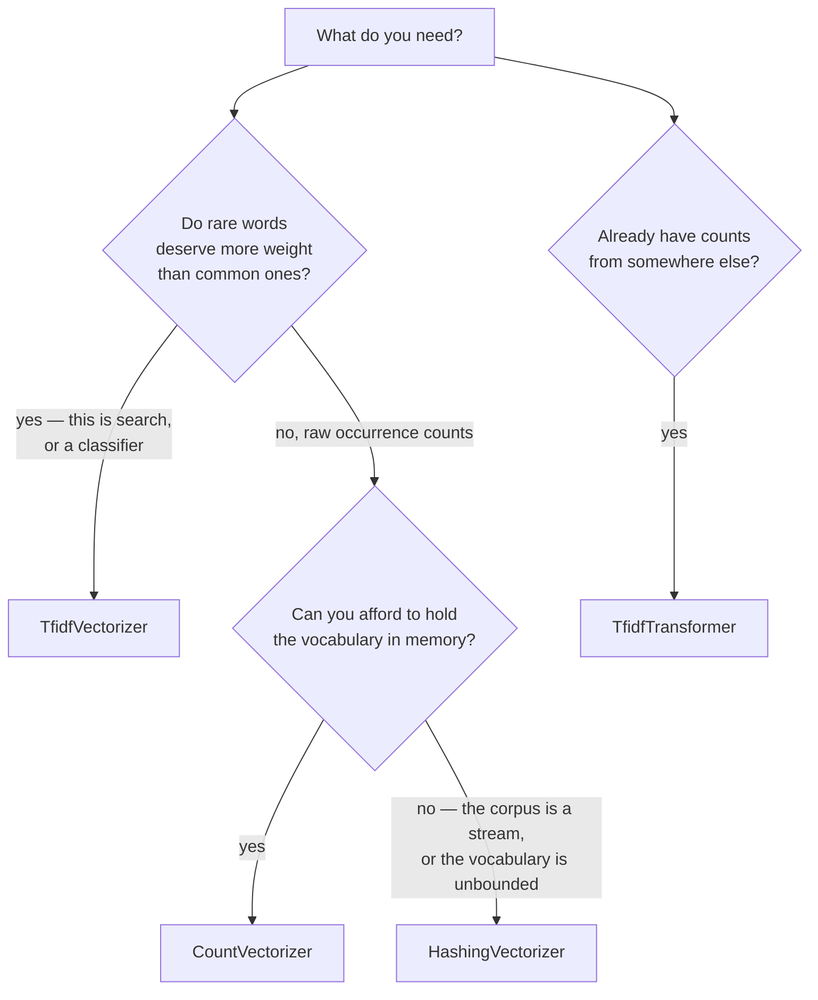

# Vectorization — `Lodestar.Text.Vectorization`

You have a corpus of documents and you need numbers. `Lodestar.Text.Vectorization`
reproduces `sklearn.feature_extraction.text`: it turns text into a **sparse matrix**
of features, one row per document and one column per term.

Three vectorizers do that, and what separates them is what they need to know about the
corpus first.

## Which vectorizer?

**[`CountVectorizer`](vectorizers/countvectorizer.md)** counts. It learns the
vocabulary from the corpus during `Fit`, so column 7 means the same term in every row
and `GetFeatureNames` can tell you which.

**[`TfidfVectorizer`](vectorizers/tfidfvectorizer.md)** counts and then weights each
count by how rare the term is across the corpus. It is
[`CountVectorizer`](vectorizers/countvectorizer.md) followed by
[`TfidfTransformer`](vectorizers/tfidftransformer.md), and doing it in one step is
the only difference.

**[`HashingVectorizer`](vectorizers/hashingvectorizer.md)** does not learn anything.
It hashes each term into one of a fixed number of columns, so it needs no `Fit`, holds
no vocabulary, and works on a stream — at the price that two terms can collide in one
column and **no `GetFeatureNames` exists**, because there is no vocabulary to name.
That trade is the whole reason to choose it.

## The three that need fitting, and the one that does not

`Fit` is where a vocabulary is learned, and it is why the order of calls matters:

| Call | What it does |
| --- | --- |
| `Fit(corpus)` | Learn the vocabulary and, for TF-IDF, the document frequencies. |
| `Transform(corpus)` | Use what was learned. Refuses if nothing was. |
| `FitTransform(corpus)` | Both, on the same corpus — and **not** the same as `Fit` then `Transform` on different ones. |

Transforming a document that holds a term the fit never saw drops that term silently:
it has no column. That is scikit-learn's behaviour, and it is why fitting on the
training corpus and transforming the test one is the correct order rather than a
convenience.

[`HashingVectorizer`](vectorizers/hashingvectorizer.md) has no `Fit` at all, and its
[`Transform`](vectorizers/hashingvectorizer-transform.md) and
[`FitTransform`](vectorizers/hashingvectorizer-fittransform.md) do the same thing —
the second exists so the three vectorizers can be swapped for one another.

## The matrix they return

Every one of them returns a [`CsrMatrix`](../abstractions/sparse/csrmatrix.md): compressed
sparse row, the same layout `scipy.sparse.csr_matrix` uses. A corpus of ten thousand
documents over fifty thousand terms is almost entirely zeros, and storing those zeros
is what this layout exists to avoid.

**The type ships in `Lodestar.Abstractions`, not here.** More than one package needs a
sparse matrix and they do not need each other, so it moved out in `Lodestar.Text` 0.5.0
— consuming code adds `using Lodestar.Abstractions;`, and
[decision 0003](../../decisions/0003-the-package-layout-tiers-boundaries-and-edges.md) says
why. Its own [reference page](../abstractions/sparse.md) documents the matrix and both of
its products.

Read [`ToDense`](../abstractions/sparse/csrmatrix-todense.md) only when you mean it: it
allocates `RowCount × ColumnCount` doubles, which is exactly the array the sparse
layout was avoiding.

## The options carry the parity

Most of what makes these match scikit-learn lives in the three options records rather
than in the vectorizers:
[`CountVectorizerOptions`](vectorizers/countvectorizeroptions.md),
[`TfidfOptions`](vectorizers/tfidfoptions.md) and
[`HashingVectorizerOptions`](vectorizers/hashingvectorizeroptions.md). Their defaults
are scikit-learn's defaults, and each property's page entry says which Python keyword
it answers to.

Two defaults surprise people, and both are scikit-learn's:

- the token pattern is `\b\w\w+\b`, so **single-letter words are dropped** — "a" and
  "I" never become features;
- `Lowercase` is on, so `Apple` and `apple` are one term.

## Types

| Type | What it is |
| --- | --- |
| [`AnalyzerKind`](vectorizers/analyzerkind.md) | Whether features are words or character n-grams. |
| [`CountVectorizer`](vectorizers/countvectorizer.md) | Term counts, over a vocabulary learned from the corpus. |
| [`CountVectorizerOptions`](vectorizers/countvectorizeroptions.md) | Everything that decides what counts as a term. |
| [`HashingVectorizer`](vectorizers/hashingvectorizer.md) | Counts into a fixed number of columns, learning nothing. |
| [`HashingVectorizerOptions`](vectorizers/hashingvectorizeroptions.md) | The column count, and what the hashing does with signs. |
| [`StopWords`](vectorizers/stopwords.md) | The six built-in stop-word lists. |
| [`TfidfOptions`](vectorizers/tfidfoptions.md) | The four switches that decide how the weighting is computed. |
| [`TfidfTransformer`](vectorizers/tfidftransformer.md) | Counts in, TF-IDF weights out. |
| [`TfidfVectorizer`](vectorizers/tfidfvectorizer.md) | `CountVectorizer` and `TfidfTransformer` in one pass. |
| [`TfidfVectorizerOptions`](vectorizers/tfidfvectorizeroptions.md) | The two halves above, as one options object. |

## See also

- [From string to vector](../../guides/vectorization.md) — the guide, which walks a
  corpus through all three rather than describing them one at a time.
- [Python → C# equivalence](../../equivalence.md) — every
  `sklearn.feature_extraction.text` call and its counterpart here.
